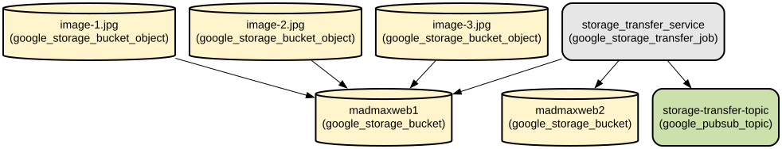

# Google Cloud Storage Transfer Service Automation with Terraform

This project automates the setup of a Google Cloud Storage (GCS) transfer service that moves files between buckets on a scheduled basis with notification capabilities. It provides a complete infrastructure-as-code solution using Terraform to manage GCS buckets, Pub/Sub topics, and Storage Transfer Service configurations.

The infrastructure setup includes automatic file transfer between two GCS buckets located in different regions, with configurable scheduling and notification systems. The solution implements best practices for GCP resource management and includes proper IAM configurations for secure operations. Key features include hourly scheduled transfers, success/failure notifications via Pub/Sub, and complete infrastructure automation using Terraform modules.

## Repository Structure
```
terraform/
├── main.tf                 # Main Terraform configuration file defining the core infrastructure
├── provider.tf             # Google Cloud provider configuration
├── variables.tf           # Global variable definitions
└── modules/               # Reusable Terraform modules
    ├── gcs/              # Google Cloud Storage bucket configuration module
    ├── pubsub/           # Pub/Sub topic configuration module
    └── storage-transfer/  # Storage Transfer Service configuration module
```

## Usage Instructions
### Prerequisites
- Google Cloud Platform account with billing enabled
- Terraform v1.0.0 or later
- Google Cloud SDK installed and configured
- Required GCP APIs enabled:
  - Cloud Storage
  - Cloud Storage Transfer Service
  - Cloud Pub/Sub

### Installation

1. Clone the repository and navigate to the terraform directory:
```bash
cd terraform
```

2. Initialize Terraform:
```bash
terraform init
```

3. Configure your GCP project ID in `provider.tf` or via environment variable:
```bash
export GOOGLE_PROJECT="your-project-id"
```

### Quick Start

1. Review and modify variables in `variables.tf` if needed:
```hcl
project_id = "your-project-id"
source_bucket_location = "asia-south1"
destination_bucket_location = "asia-south2"
```

2. Plan the deployment:
```bash
terraform plan
```

3. Apply the configuration:
```bash
terraform apply
```

### More Detailed Examples

1. Customizing the transfer schedule:
```hcl
schedule = [
  {
    start_year = 2024
    start_month = 1
    start_day = 1
    end_year = 2024
    end_month = 12
    end_day = 31
    hours = 0
    minutes = 0
    seconds = 0
    nanos = 0
    schedule_repeat_interval = "3600s"
  }
]
```

2. Configuring Pub/Sub notifications:
```hcl
notification_config = [
  {
    pubsub_topic = module.topic.id
    event_types = [
      "TRANSFER_OPERATION_SUCCESS",
      "TRANSFER_OPERATION_FAILED"
    ]
    payload_format = "JSON"
  }
]
```

### Troubleshooting

Common issues and solutions:

1. IAM Permission Issues
- Error: "Permission denied for Storage Transfer Service"
- Solution: Ensure the Storage Transfer Service account has the required IAM roles:
```bash
gcloud projects add-iam-policy-binding PROJECT_ID \
    --member serviceAccount:PROJECT_NUMBER@storage-transfer-service.iam.gserviceaccount.com \
    --role roles/storage.admin
```

2. Bucket Access Issues
- Error: "Access denied to source/destination bucket"
- Solution: Verify bucket IAM permissions and bucket names in the configuration

3. Transfer Job Scheduling Issues
- Error: "Invalid schedule configuration"
- Solution: Ensure schedule times are in the future and properly formatted

## Data Flow

The system transfers files from a source GCS bucket to a destination bucket on a scheduled basis, with status notifications sent to a Pub/Sub topic.

```ascii
Source Bucket (asia-south1)
        |
        v
Storage Transfer Service
        |
        v
Destination Bucket (asia-south2)
        |
        v
Pub/Sub Notifications
```

Component interactions:
1. Storage Transfer Service authenticates using service account credentials
2. Source bucket contents are read and compared with destination
3. Files are transferred according to the configured schedule
4. Transfer status notifications are published to Pub/Sub topic
5. IAM roles control access between components

## Infrastructure



### Storage
- Source Bucket: `madmaxweb1` (Standard storage class, asia-south1)
- Destination Bucket: `madmaxweb2` (Standard storage class, asia-south2)

### Pub/Sub
- Topic: Configured for transfer notifications
- IAM: Publisher role granted to Storage Transfer Service

### Storage Transfer Service
- Schedule: Hourly transfers
- Notifications: Success and failure events
- IAM: Storage admin role on both buckets

## Deployment

1. Prerequisites:
- Enable required GCP APIs
- Configure GCP credentials

2. Deployment steps:
```bash
terraform init
terraform plan
terraform apply
```

3. Verify deployment:
```bash
gcloud storage buckets list
gcloud pubsub topics list
gcloud transfer jobs list
```